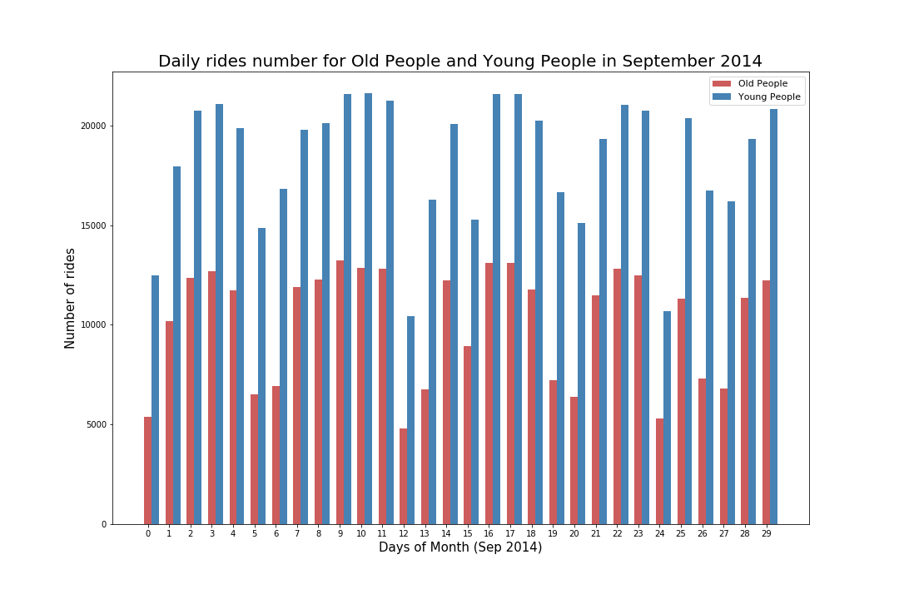

# Assignment 1

Find outliers, trends and periodicity in the MTA turnstyle data. And build a classifier that assigns a card type to a time series based on time series features

# Assignment 2

## Figure 1

Here is the histogram about the number of old (age>=45) and young (age<45) people riding citi bike through 09.2014, which shows by days. I use this figure to find the difference between the number of old and young people riding citi bike. From this figure, we can see that the number of young people who ride citi bike in 09.2014 is much higher than the number of old people through the whole month.

## Improvement

Here I optimize the legend to prevent it to obscure the figure and add the age range. And use larger fontsize to make sure reader see the plot clearly. Change the title to 'Daily rides number for Old People and Young People in September 2014' and change the y-axis label to 'Days of Month (Sep 2014)'. What's more, I remove the error bar in case it leads some misunderstanding. And I make the bars for next to each other (not stacked) to compare their magnitude.

# Contribution

I finish this homework by myself.