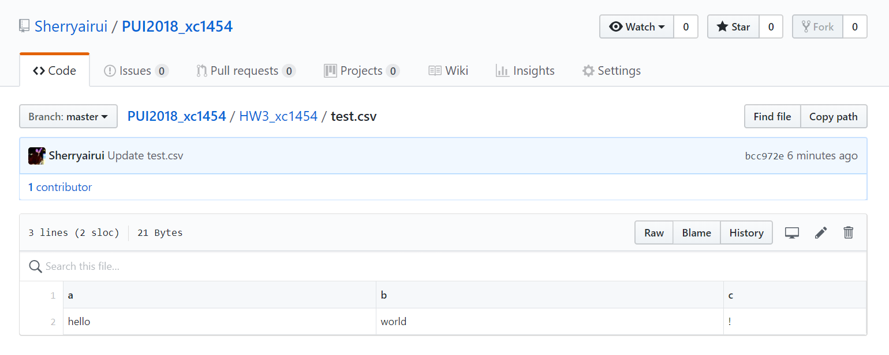
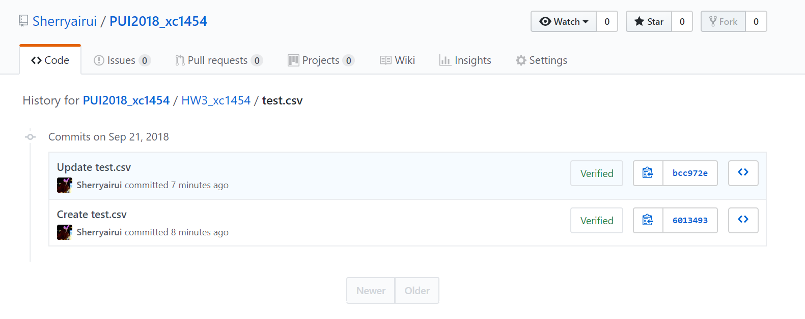
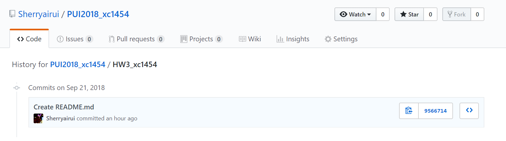

## Assignment 1

1. I make a .csv file. Here is the screenshoot of my repo and folder HW3_xc1454's history.





2. I go to my terminal and pull the changes. Then I type the commands that allow you to remove the file AND ITS HISTORY from the repo. Here is the screenshoot.


3. Now I back to my github, the file and its history are gone. Here is the screenshoot after removing.



## Assignment 2

1. I go to the [NYC Open Data](https://opendata.cityofnewyork.us/) to get the data in CSV format. The data is [Business Solutions Business Courses](https://data.cityofnewyork.us/Business/Business-Solutions-Business-Courses/de8q-estm).

2. I show the first 7 rows of the data and get 2 numerical values columns.

3. I plot those two values and add axes label and caption.

## Extra Credit Assignment

1. I got the same data as 'Assignment 2' in json file.

2. I pick a time column and a numerical value. Use ```pd.Timestamp``` to make the time more readable. Noting that there are some raws missing the time data, I delete those missing data.

3. I plot the numerical value change through time and add axes label and caption.

## Assignment 3 and 4

1. Use API key to access the MTA [SIRI VehicleMonitoring data](http://bustime.mta.info/wiki/Developers/SIRIVehicleMonitoring).

2. Parse the json file. For assignment 3, I output the Bus Line, Number of Active Buses, latitude and longitude in terminal. For assignment 4, I output the Latitude, Longitude, Stop Name and Stop Status in a .csv file.
