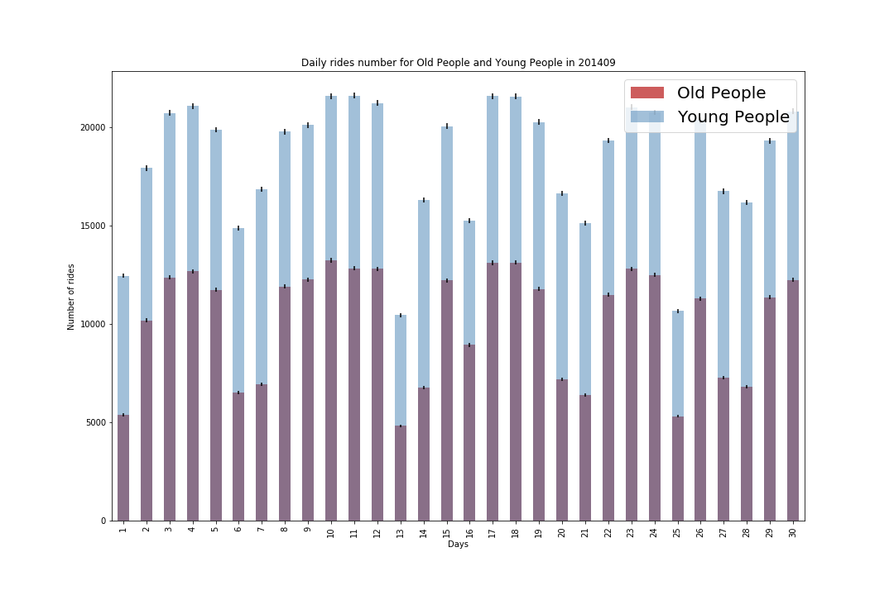

# Assignment 1

## Figure 1

Here is the histogram about the number of old (age>=45) and young (age<45) people riding citi bike through 09.2014, which shows by days. I use this figure to find the difference between the number of old and young people riding citi bike and consider about the error on the count statistics, which shows on the figure. From this figure, we can see that even considering about the error on the count statistics, the number of young people who ride citi bike in 09.2014 is still much higher than the number of old people through the whole month.

# Assignment 2

Here is the link of my classmate review document: https://github.com/Sherryairui/PUI2018_xc1454/blob/master/Xurui_HW4_review.md

Here is the link of Authorea:https://www.authorea.com/335946/RJIpM2mm1-vtaiuj2qDeWw

# Contribution

I finish this homework by myself.