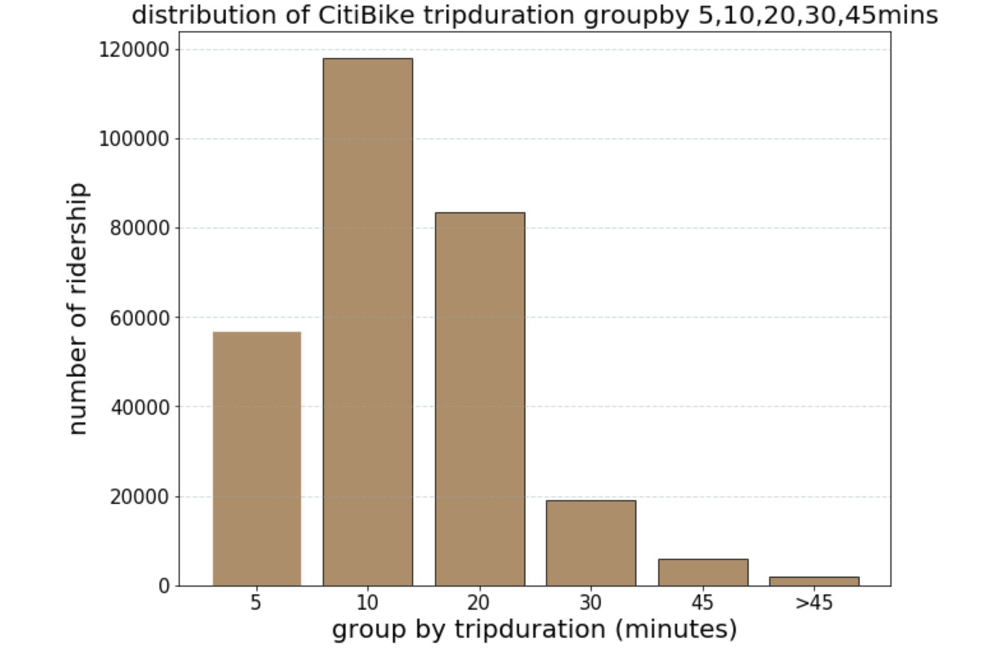

## Clarity

The scale of x-axis makes people feel confused. Each bar means the trip duration lower than the time in the x-axis. Such as the first bar means the trip duration lower than 5 mins. However, the x-axis scale looks like the trip duration around 5 mins. You could change the scale into 0~5, 5~10, 10~20, 20~30, 30~45, 45~.

## Esthetic

The first bar does not have the black margin like other bars. All bars should have the same elements, as each bar should get the same attention when people see this figure.

## Honesty

This plot does not honestly reproduce the data, as each bar has a different range of trip duration. Each bar should have the same range of trip duration, which will make the data fairer.

